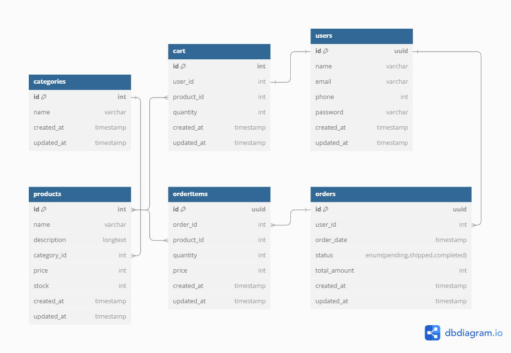

# E-Commerce Backend Platform Documentation

## Table of Contents
1. [Introduction](#introduction)
2. [System Requirements](#system-requirements)
3. [Installation Guide](#installation-guide)
4. [Database Schema and ER Diagram](#database-schema-and-er-diagram)
5. [Swagger UI Integration](#swagger-ui-integration)
6. [Running the Application](#running-the-application)

---

## 1. Introduction <a name="introduction"></a>
This is the backend of an e-commerce platform built using **Spring Boot**, **Oracle Database**, and **Swagger UI**. The API provides essential features for managing users, products, orders, and carts. It also integrates Swagger UI for easy interaction with the API.

---

## 2. System Requirements <a name="system-requirements"></a>
- **Java 17** or higher
- **Oracle Database** 12c or higher
- **Spring Boot** 2.5.x or higher
- **Maven** (for building the project)
- **Git** (for version control)

---

## 3. Installation Guide <a name="installation-guide"></a>

### Step 1: Clone the Repository
```bash
git clone https://github.com/Thu-Min/e-commerce-platform.git
```

### Step 2: Set Up Oracle Database
- Install Oracle Database (if not installed)
- Create a new schema and user for the e-commoerce platform
- Set up the following connection parameters in ```src/main/resources/application.properties```

```bash
spring.datasource.url=jdbc:oracle:thin:@localhost:1521:orcl
spring.datasource.username=your_db_username
spring.datasource.password=your_db_password
spring.jpa.hibernate.ddl-auto=update
spring.jpa.properties.hibernate.dialect=org.hibernate.dialect.Oracle12cDialect
```

### Step 3: Install Dependencies and Build the Project
```bash
mvn clean install
```

### Step 4: Run the Application
```bash
mvn spring-boot:run
```
The application will start at ```http://localhost:8080```

---

## 4. Database Schema and ER Diagram <a name="database-schema-and-er-diagram"></a>


The platform uses an Oracle database with the following entities:
- **User**: Manages user details
- **Product**: Stores product information
- **Category**: Stores category information
- **Order**: Handles order data
- **OrderDetails**: Links products to orders
- **Cart**: Represents user carts

---

## 5. Swagger UI Integration <a name="swagger-ui-integration"></a>

To access and test the API using Swagger UI, navigate to:
```http://localhost:8080/swagger-ui.html```

Swagger UI automatically documents all endpoints with request and response formats. You can interact with the API from the UI.

**Note** Current APIs cannot test with Swagger UI.
Download the following postman collection and test the APIs with postman.
<br>
[e-commerce.postman_collection.json](e-commerce.postman_collection.json)

---

## 6. Running the Application <a name="running-the-application"></a>

Follow these steps to start the backend application:
- Clone the repository
- Set up Oracle Database and update your connection properties
- Run the following command to start the application: ```mvn spring-boot:run```
- Access the API at ```http://localhost:8080```
- Use Swagger UI for API documentation at ```http://localhost:8080/swagger-ui.html```
- Use Postman for API testing